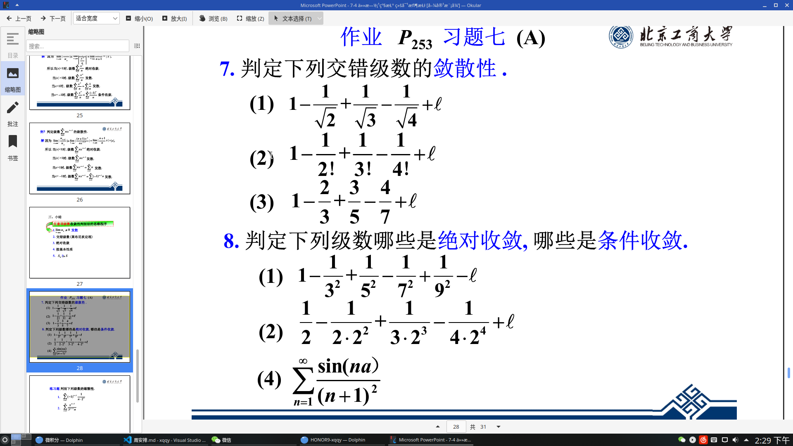
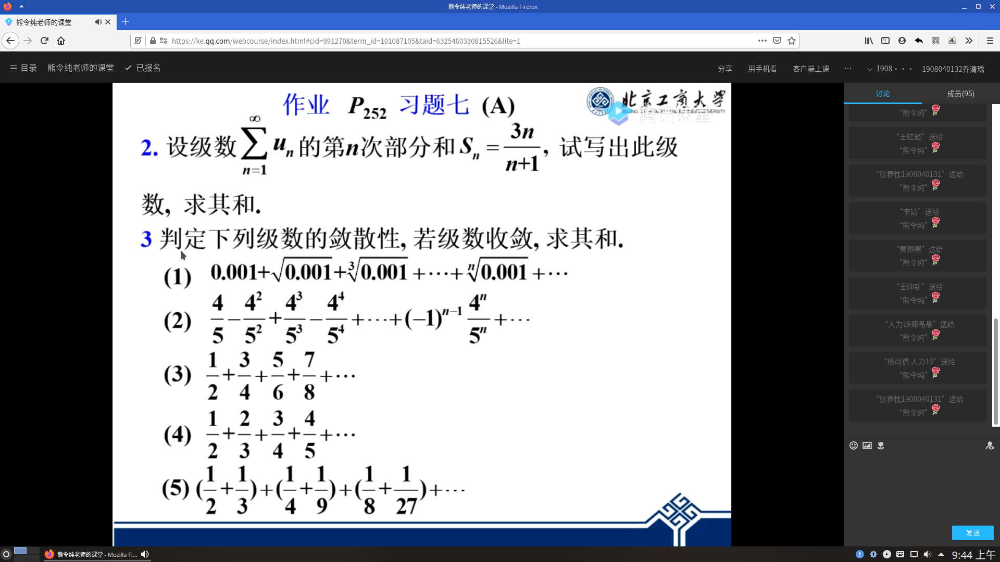
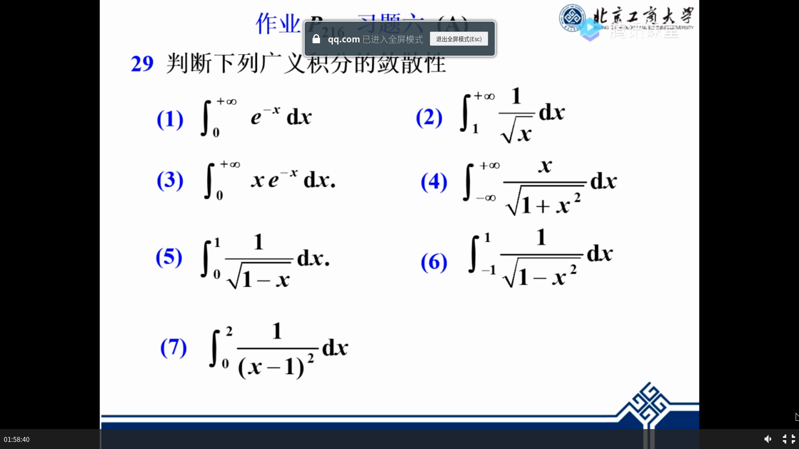
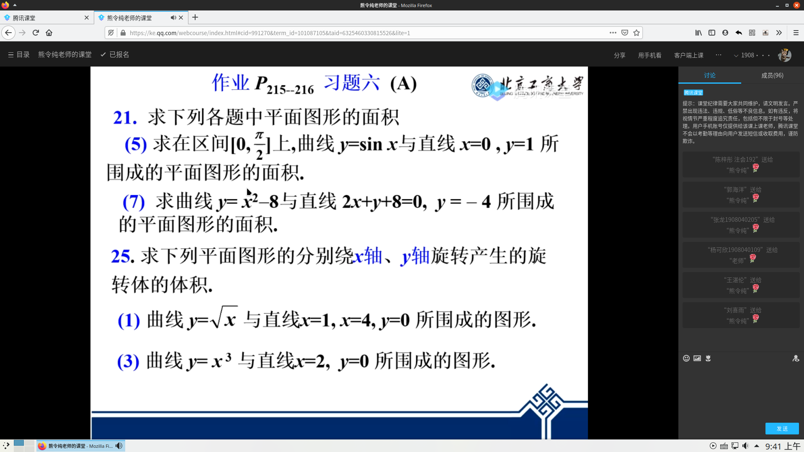

## 第6周
### 周安排
- 课表，选修课不计入在内

|| 周一 | 周二 | 周三 | 周四 | 周五|
|-------|-----|------|------|------|-----|
|01-02|计算机技术：[腾讯课堂直播](https://ke.qq.com/)|管理学：[zoom](https://zoom.cn/)|微观经济学：[腾讯课堂直播](https://ke.qq.com/)|微积分：[腾讯课堂直播](https://ke.qq.com/)|会计学原理：[腾讯会议](https://meeting.tencent.com/download-center.html?from=1001)
|03-04|                                            |微积分：[腾讯课堂直播](https://ke.qq.com/)|大学英语：分层要求不同|体育：分层要求不同|税法：[在线课堂慕课](https://next.xuetangx.com/learn/btbu03011002365/btbu03011002365/1520546/video/1484377)
|05-06|计算机技术：[腾讯课堂直播](https://ke.qq.com/)|大学英语：分层要求不同|微观经济学：[腾讯课堂直播](https://ke.qq.com/)|           |会计学原理：[在线课堂慕课](https://next.xuetangx.com/learn/btbu02021002319/btbu02021002319/1518658/video/1433356)+[腾讯会议（备选）](https://meeting.tencent.com/download-center.html?from=1001)
|07-08|中国近现代史纲要：[超星学习通慕课](http://i.mooc.chaoxing.com)|管理学：[zoom](https://zoom.cn/)|心理教育：[学堂在线](https://next.xuetangx.com/)+[腾讯会议](https://meeting.tencent.com/download-center.html?from=1001)+[雨课堂直播](https://www.yuketang.cn/web?index)|               |
|7:30-8：30|  |  | |微积分商梦花开补习|  |

### 作业事项

- 计算机技术：完成学校系统上的所有题目；本周的比较难
- 管理学：做[作业1：70后CEO王小川](../管理学/作业1：70后CEO王小川.pdf)和[作业1：柯达](../管理学/作业1：柯达.pdf)；以Microsoft word2007-365（docx）格式发给学习委员，电子版文件名称：班级+姓名+学号；**截止于4月10日上午12点，建议在4月8日之后交**
- 党员思想汇报：要求见[这里](../post/%E6%96%B0%E5%9E%8B%E5%86%A0%E7%8A%B6%E8%82%BA%E7%82%8E%E9%80%9A%E7%9F%A5%E5%90%88%E5%B9%B6/#%E6%80%9D%E6%83%B3%E6%B1%87%E6%8A%A5)文件使用Microsoft Word2007-365（docx）格式提交至[https://www.wjx.cn/jq/66891649.aspx](https://www.wjx.cn/jq/66891649.aspx)；截止时间未知
- 微积分：复习[泰勒公式](../微积分/§7.5幂级数(二).pdf)

---


## 第7周
### 周安排
- 课表，选修课不计入在内

|| 周一 | 周二 | 周三 | 周四 | 周五|
|-------|-----|------|------|------|-----|
|01-02|计算机技术：[腾讯课堂直播](https://ke.qq.com/)|管理学：[zoom](https://zoom.cn/)|微观经济学：[腾讯课堂直播](https://ke.qq.com/)|微积分：[腾讯课堂直播](https://ke.qq.com/)|会计学原理：[腾讯会议](https://meeting.tencent.com/download-center.html?from=1001)
|03-04|                                            |微积分：[腾讯课堂直播](https://ke.qq.com/)|大学英语：分层要求不同|体育：分层要求不同|税法：[在线课堂慕课](https://next.xuetangx.com/learn/btbu03011002365/btbu03011002365/1520546/video/1484377)
|05-06|计算机技术：[腾讯课堂直播](https://ke.qq.com/)|大学英语：分层要求不同|微观经济学：[腾讯课堂直播](https://ke.qq.com/)|中国近现代史纲要：[超星学习通慕课](http://i.mooc.chaoxing.com)|会计学原理：[在线课堂慕课](https://next.xuetangx.com/learn/btbu02021002319/btbu02021002319/1518658/video/1433356)+[腾讯会议（备选）](https://meeting.tencent.com/download-center.html?from=1001)
|07-08|中国近现代史纲要：[超星学习通慕课](http://i.mooc.chaoxing.com)|管理学：[zoom](https://zoom.cn/)|心理教育：[学堂在线](https://next.xuetangx.com/)+[腾讯会议](https://meeting.tencent.com/download-center.html?from=1001)+[雨课堂直播](https://www.yuketang.cn/web?index)|               |税法：[在线课堂慕课](https://next.xuetangx.com/learn/btbu03011002365/btbu03011002365/1520546/video/1484377)
|晚7:30-8:30 | | | | |微观经济学（学业辅导）

### 作业事项

- 计算机技术：完成学校系统上的所有题目；本周的比较难
- 管理学：做[作业1：70后CEO王小川](../管理学/作业1：70后CEO王小川.pdf)和[作业1：柯达](../管理学/作业1：柯达.pdf)；以Microsoft word2007-365（docx）格式发给学习委员，电子版文件名称：班级+姓名+学号；截止于4月10日上午12点，建议在4月8日之后交
- 会计学原理：做[第二章练习题2](../会计学原理/第2章作业2.doc)；截止于本周五上午8点前
- 党员思想汇报：要求见[这里](../post/%E6%96%B0%E5%9E%8B%E5%86%A0%E7%8A%B6%E8%82%BA%E7%82%8E%E9%80%9A%E7%9F%A5%E5%90%88%E5%B9%B6/#%E6%80%9D%E6%83%B3%E6%B1%87%E6%8A%A5)文件使用Microsoft Word2007-365（docx）格式提交至[https://www.wjx.cn/jq/66891649.aspx](https://www.wjx.cn/jq/66891649.aspx)；截止时间未知
- 微积分：见图片；不收



---
## 第6周
### 周安排
- 课表，选修课不计入在内

|| 周一 | 周二 | 周三 | 周四 | 周五|
|-------|-----|------|------|------|-----|
|01-02|计算机技术：[腾讯课堂直播](https://ke.qq.com/)|管理学：[zoom](https://zoom.cn/)|微观经济学：[腾讯课堂直播](https://ke.qq.com/)|微积分：[腾讯课堂直播](https://ke.qq.com/)|会计学原理：[腾讯会议](https://meeting.tencent.com/download-center.html?from=1001)
|03-04|                                            |微积分：[腾讯课堂直播](https://ke.qq.com/)|大学英语：分层要求不同|体育：分层要求不同|税法：[在线课堂慕课](https://next.xuetangx.com/learn/btbu03011002365/btbu03011002365/1520546/video/1484377)
|05-06|计算机技术：[腾讯课堂直播](https://ke.qq.com/)|大学英语：分层要求不同|微观经济学：[腾讯课堂直播](https://ke.qq.com/)|           |会计学原理：[在线课堂慕课](https://next.xuetangx.com/learn/btbu02021002319/btbu02021002319/1518658/video/1433356)+[腾讯会议（备选）](https://meeting.tencent.com/download-center.html?from=1001)
|07-08|中国近现代史纲要：[超星学习通慕课](http://i.mooc.chaoxing.com)|管理学：[zoom](https://zoom.cn/)|心理教育：[学堂在线](https://next.xuetangx.com/)+[腾讯会议](https://meeting.tencent.com/download-center.html?from=1001)+[雨课堂直播](https://www.yuketang.cn/web?index)|               |

### 作业事项

- 计算机技术：完成学校系统上的所有题目
- 管理学：做[作业1：70后CEO王小川](../管理学/作业1：70后CEO王小川.pdf)和[作业1：柯达](../管理学/作业1：柯达.pdf)；以Microsoft word2007-365（docx）格式发给学习委员，电子版文件名称：班级+姓名+学号
- 会计学原理：做[第二章练习题2](../会计学原理/第2章作业2.doc)
- 党员思想汇报：要求见[这里](../post/%E6%96%B0%E5%9E%8B%E5%86%A0%E7%8A%B6%E8%82%BA%E7%82%8E%E9%80%9A%E7%9F%A5%E5%90%88%E5%B9%B6/#%E6%80%9D%E6%83%B3%E6%B1%87%E6%8A%A5)文件使用Microsoft Word2007-365（docx）格式提交至[https://www.wjx.cn/jq/66891649.aspx](https://www.wjx.cn/jq/66891649.aspx)
- 微积分：见图片


---
## 第5周
### 周安排
- 课表，选修课不计入在内

|| 周一 | 周二 | 周三 | 周四 | 周五|
|-------|-----|------|------|------|-----|
|01-02|计算机技术：[腾讯课堂直播](https://ke.qq.com/)|管理学：[zoom](https://zoom.cn/)|微观经济学：[腾讯课堂直播](https://ke.qq.com/)|微积分：[腾讯课堂直播](https://ke.qq.com/)|会计学原理：[腾讯会议](https://meeting.tencent.com/download-center.html?from=1001)
|03-04|                                            |微积分：[腾讯课堂直播](https://ke.qq.com/)|大学英语：分层要求不同|体育：分层要求不同|税法：[在线课堂慕课](https://next.xuetangx.com/learn/btbu03011002365/btbu03011002365/1520546/video/1484377)
|05-06|计算机技术：[腾讯课堂直播](https://ke.qq.com/)|大学英语：分层要求不同|微观经济学：[腾讯课堂直播](https://ke.qq.com/)|中国近现代史纲要：[超星学习通慕课](http://i.mooc.chaoxing.com)|会计学原理：[在线课堂慕课](https://next.xuetangx.com/learn/btbu02021002319/btbu02021002319/1518658/video/1433356)+[腾讯会议（备选）](https://meeting.tencent.com/download-center.html?from=1001)
|07-08|中国近现代史纲要：[超星学习通慕课](http://i.mooc.chaoxing.com)|管理学：[zoom](https://zoom.cn/)|心理教育：[学堂在线](https://next.xuetangx.com/)+[腾讯会议](https://meeting.tencent.com/download-center.html?from=1001)+[雨课堂直播](https://www.yuketang.cn/web?index)|               |税法：[在线课堂慕课](https://next.xuetangx.com/learn/btbu03011002365/btbu03011002365/1520546/video/1484377)

### 作业事项

- 计算机技术：完成学校系统上的所有题目
- 学习强国总结,请按照[此模板](../新冠/XXX公开课学习心得.docx)写
- 会计学原理：编制此[报表](../会计学原理/第2章作业1.docx)，将文件传给学委
- 微积分：见图片



---
## 第4周
### 周安排
- 课表，选修课不计入在内

|| 周一 | 周二 | 周三 | 周四 | 周五|
|-------|-----|------|------|------|-----|
|01-02|计算机技术：[腾讯课堂直播](https://ke.qq.com/)|管理学：[zoom](https://zoom.cn/)|微观经济学：[腾讯课堂直播](https://ke.qq.com/)|微积分：[腾讯课堂直播](https://ke.qq.com/)|会计学原理：[腾讯会议](https://meeting.tencent.com/download-center.html?from=1001)
|03-04|                                            |微积分：[腾讯课堂直播](https://ke.qq.com/)|大学英语：分层要求不同|体育：分层要求不同|税法：[在线课堂慕课](https://next.xuetangx.com/learn/btbu03011002365/btbu03011002365/1520546/video/1484377)
|05-06|计算机技术：[腾讯课堂直播](https://ke.qq.com/)|大学英语：分层要求不同|微观经济学：[腾讯课堂直播](https://ke.qq.com/)|           |会计学原理：[在线课堂慕课](https://next.xuetangx.com/learn/btbu02021002319/btbu02021002319/1518658/video/1433356)+[腾讯会议（备选）](https://meeting.tencent.com/download-center.html?from=1001)
|07-08|中国近现代史纲要：[超星学习通慕课](http://i.mooc.chaoxing.com)|管理学：[zoom](https://zoom.cn/)|心理教育：[学堂在线](https://next.xuetangx.com/)+[腾讯会议](https://meeting.tencent.com/download-center.html?from=1001)+[雨课堂直播](https://www.yuketang.cn/web?index)|               |

### 作业事项

- 计算机技术：完成学校系统上第二章的所有题目
- 微积分：见图片
- 学习强国总结,请按照[此模板](../新冠/XXX公开课学习心得.docx)写
- 会计学原理：编制此[报表](../会计学原理/第2章作业1.docx)，将文件传给学委




---
## 第3周
### 周安排
- 课表，选修课不计入在内

|| 周一 | 周二 | 周三 | 周四 | 周五|
|-------|-----|------|------|------|-----|
|01-02|计算机技术：[腾讯课堂直播](https://ke.qq.com/)|管理学：[zoom](https://zoom.cn/)|微观经济学：[腾讯课堂直播](https://ke.qq.com/)|微积分：[腾讯课堂直播](https://ke.qq.com/)|会计学原理：[腾讯会议](https://meeting.tencent.com/download-center.html?from=1001)
|03-04|                                            |微积分：[腾讯课堂直播](https://ke.qq.com/)|大学英语：分层要求不同|体育：分层要求不同|税法：[在线课堂慕课](https://next.xuetangx.com/learn/btbu03011002365/btbu03011002365/1520546/video/1484377)
|05-06|计算机技术：[腾讯课堂直播](https://ke.qq.com/)|大学英语：分层要求不同|微观经济学：[腾讯课堂直播](https://ke.qq.com/)|中国近现代史纲要：[超星学习通慕课](http://i.mooc.chaoxing.com)|会计学原理：[在线课堂慕课](https://next.xuetangx.com/learn/btbu02021002319/btbu02021002319/1518658/video/1433356)+[腾讯会议（备选）](https://meeting.tencent.com/download-center.html?from=1001)
|07-08|中国近现代史纲要：[超星学习通慕课](http://i.mooc.chaoxing.com)|管理学：[zoom](https://zoom.cn/)|心理教育：[学堂在线](https://next.xuetangx.com/)+[腾讯会议](https://meeting.tencent.com/download-center.html?from=1001)+[雨课堂直播](https://www.yuketang.cn/web?index)|               |税法：[在线课堂慕课](https://next.xuetangx.com/learn/btbu03011002365/btbu03011002365/1520546/video/1484377)

### 作业事项

- 计算机技术：完成学校系统上第二章的所有题目
- 税法：学习增值税法案例，不需提交
- 微积分：见图片




---
## 第2周

### 周安排
- 课表，选修课不计入在内

|| 周一 | 周二 | 周三 | 周四 | 周五|
|-------|-----|------|------|------|-----|
|01-02|计算机技术：[腾讯课堂直播](https://ke.qq.com/)|管理学：[zoom](https://zoom.cn/)|微观经济学：[腾讯课堂直播](https://ke.qq.com/)|微积分：[腾讯课堂直播](https://ke.qq.com/)|会计学原理：[腾讯会议](https://meeting.tencent.com/download-center.html?from=1001)
|03-04|                                            |微积分：[腾讯课堂直播](https://ke.qq.com/)|大学英语：分层要求不同|体育：分层要求不同|税法：[在线课堂慕课](https://next.xuetangx.com/learn/btbu03011002365/btbu03011002365/1520546/video/1484377)
|05-06|计算机技术：[腾讯课堂直播](https://ke.qq.com/)|大学英语：分层要求不同|微观经济学：[腾讯课堂直播](https://ke.qq.com/)|           |会计学原理：[在线课堂慕课](https://next.xuetangx.com/learn/btbu02021002319/btbu02021002319/1518658/video/1433356)+[腾讯会议（备选）](https://meeting.tencent.com/download-center.html?from=1001)
|07-08|中国近现代史纲要：[超星学习通慕课](http://i.mooc.chaoxing.com)|管理学：[zoom](https://zoom.cn/)|心理教育：[学堂在线](https://next.xuetangx.com/)+[腾讯会议](https://meeting.tencent.com/download-center.html?from=1001)+[雨课堂直播](https://www.yuketang.cn/web?index)|               |

### 作业事项

- 中国近现代史思考题：
   - 查资料搞清楚是什么李约瑟之谜，什么是韦伯疑问？（不超过200字）请大家准备一张白纸，每次作业不超过200字。写清日期，写在同一张纸上，开学后我们要收。
   - 完成超星平台上的讨论题
- 计算机技术：完成学校系统上第一章的所有题目
- 心理：
  -  “疫情期间你在自我心里关照方面都做了哪些事情？有了哪些成长和进步。”
  - “我带给我亲人的感动瞬间”，采访父母或其他亲人，与其核对，看看你们留在记忆中的感动瞬间是否相同，你通过采访有了什么新的觉察。
  - 马斯诺的需要层次理论会考
- 微积分：PPT6.3章节最后一张

---

## 第1周
### 周安排
- 课表，选修课不计入在内

|| 周一 | 周二 | 周三 | 周四 | 周五|
|-------|-----|------|------|------|-----|
|01-02|计算机技术：[腾讯课堂直播](https://ke.qq.com/)|管理学：[zoom](https://zoom.cn/)|微观经济学：[腾讯课堂直播](https://ke.qq.com/)|微积分：[腾讯课堂直播](https://ke.qq.com/)|会计学原理：[腾讯会议](https://meeting.tencent.com/download-center.html?from=1001)
|03-04|                                            |微积分：[腾讯课堂直播](https://ke.qq.com/)|大学英语：分层要求不同|体育：分层要求不同|税法：[在线课堂慕课](https://next.xuetangx.com/learn/btbu03011002365/btbu03011002365/1520546/video/1484377)
|05-06|计算机技术：[腾讯课堂直播](https://ke.qq.com/)|大学英语：分层要求不同|微观经济学：[腾讯课堂直播](https://ke.qq.com/)|中国近现代史纲要：[超星学习通慕课](http://i.mooc.chaoxing.com)|会计学原理：[在线课堂慕课](https://next.xuetangx.com/learn/btbu02021002319/btbu02021002319/1518658/video/1433356)+[腾讯会议（备选）](https://meeting.tencent.com/download-center.html?from=1001)
|07-08|中国近现代史纲要：[超星学习通慕课](http://i.mooc.chaoxing.com)|管理学：[zoom](https://zoom.cn/)|心理教育：[学堂在线](https://next.xuetangx.com/)+[腾讯会议](https://meeting.tencent.com/download-center.html?from=1001)+[雨课堂直播](https://www.yuketang.cn/web?index)|               |税法：[在线课堂慕课](https://next.xuetangx.com/learn/btbu03011002365/btbu03011002365/1520546/video/1484377)

### 作业事项

- 中国近现代史思考题：查资料搞清楚是什么李约瑟之谜，什么是韦伯疑问？（不超过200字）请大家准备一张白纸，每次作业不超过200字。写清日期，写在同一张纸上，开学后我们要收。
- 心理：
  -  “疫情期间你在自我心里关照方面都做了哪些事情？有了哪些成长和进步。”
  - “我带给我亲人的感动瞬间”，采访父母或其他亲人，与其核对，看看你们留在记忆中的感动瞬间是否相同，你通过采访有了什么新的觉察。
  - 马斯诺的需要层次理论会考
- 微积分：PPT6.3章节最后一张

---

## 第0周
### 周安排
- 当前仍处在寒假假期，会计学原理和中国近现代史教科书可通过快递发货

### 新冠停课不停学事项

#### 大学生心理课
- 转发自微信

```
各位同学：
因疫情原因，本学期的心理健康教育课课程教学方式将采用三种方式：一是同学们要在“雨课堂”教学平台上学习任课教师推送的预习课件，参与雨课堂课程授课，完成课堂作业和课下作业；二是同学们要自主学习由任课老师指定的《学堂在线》教学平台上《大学生心理健康》慕课；三是同学们还要参与网络视频互动答疑。因此需要同学们预先在手机上下载《学堂在线》APP和“腾讯会议”APP，或在电脑上下载相关软件。如有疑问请联系本班心理委员进行沟通解决。

```
 

#### 管理学
1. 各位同学好，2月16日下午4点左右进行进行雨课堂测试和ZOOM视频会议测试，Zoom 是雨课堂的备选方式。
2. ZOOM是免费的，大家是需要在手机上下载应用或电脑上下载相关程序即可，注意不需要注册任何个人信息，只需要在开课时间（参加会议）输入手机号即可。

#### 税法
- 税法课程要求所有答疑在视频的讨论区进行。微信群用于发布通知。讨论区的发帖积极程度将影响平时成绩
- 重要事项会在慕课《税法》的“课程公告”板块通知，请同学们及时查看。
- 上课后需要完成配套的课后作业，另外会有一些不定期发布的讨论题，也请同学按时完成。
- 请大家将学堂在线中的昵称和真实姓名改为姓名+学号

#### 计算机技术
- 请大家下载安装DEV-CPP，如有问题可联系班长

#### 中国近现代史纲要，陈晋文
- 请进行学习签到(2020/02/13)
- 请大家下载超星学习通，并按照手机号登陆，绑定学号
- 如果超星崩溃，请大家微信群上课。

#### 会计学原理-欧阳爱平

##### 2020/02/16
-  复制自微信聊天记录
```
远程授课对全国的老师与学生来说都是第一次，需要一些时间适应，更需要相互配合、理解。之前我已将课程教学大纲、42讲慕课视频内容、及上面前7周的具体教学内容与方法发大家，主要是加强沟通，加深你们对本课程及教师教学的了解，进而提高你们的学习效率。建议课前先看。
```

##### 2020/02/14
- 复制自微信聊天记录
```
因为我请你们注册在前，郝老师的要求跟我不一样，正确的做法是：告诉我，我再跟郝老师商量。
现在我不清楚你们是否都按郝老师要求修改了？

用户名指个人信息中的姓名，要求实名注册

微信中也有微信名、昵称，两者不是一回事。

@all 请大家还是按照之前我说的规范学堂在线注册信息，因为这是我们19级会计、财务管理专业统一的注册方法，也考虑了之后到后台打印相关学习记录。

其中，用户名指个人信息中的姓名，要求实名注册。

```

##### 2020/02/13

- 下周五开始，到学堂在线看视频，用电脑登录；手机留着。当你们看完规定视频内容，先不下线，回到手机的微信群里咱们一起开会，我再串讲一下本讲的内容以及上下讲之间的联系；课堂讨论包括你们直接提问我回答或我请你们回答问题….。之后，你们再回到线上看视频、做习题。我认为这样可提高学习效率，除相互不见面，也与在校学习基本没差别。(2020/02/13)
这就要求每个同学同时准备手机与电脑。看线上视频、登录微信，在电脑上切换估计没问题，但在手机上切换可能不行。更主要的是，你们上线了，下课前就不要下来（挂在线上，回头打开手机微信群参会）。因为线上学习的人多，下来后就可能上不去了。(2020/02/13)
- 有的同学对第1、2讲视频可能已学习过，哪是你们自学。现在是正式上课，要求按规定统一学习。
- 线上的练习题已全部更换，看完视频记得做练习。(2020/02/13)
- 每次上课前，需看哪几讲视频，是先看视频还是先在微信群里开会，请你们关注我的提前通知。不管哪种情况，请大家至少提前3分钟登录，不能迟到。**记住：上课时间与课表时间一致。**(2020/02/13)
##### 之前的

- 从下周开始，全国高校都开学并实行网上上课，诸多课程都集中在学堂在线（属于教育部的慕课网），登录时可能会遇到“堵车”。故请大家本周一定注册好。（2020/02/12）
- 书稿不能上传网页，清华大学出版社拥有版权，怕出问题。本群不到50人，不大，好管理。我认为你们按课程分别建群管理比较合适。若将本学期你们上的所有课程资料搞到一起，我认为会很乱，查找某课程的资料也会不易。不管你们怎么处理，会计学原理课的事就在微信群解决了。以后也没有太多的资料发啦，只有作业！（2020/02/10）
- 在线学堂需要在线注册，必须实名，并注明班级（姓名为真实姓名，昵称为学号，学校为北京工商大学注会191）。否则，无法统计的线上学习情况。
- 新冠期间，教学以教材内容+看慕课+教师答疑+课后作业为方式。教材内容和教学大纲在会计学原理微信群里面有（找不到的找班长要）
- 请大家注意，第三章、第七章、第八章的2-6节不属于教学内容，无需学习

---

## 2019-2020第一学期周安排存档

## 第18周
### 周安排
- 周一：暂无安排
- 周二：暂无安排
- 周三：元旦放假
- 周四：可以到文体馆进行英语考试听力试音了
- 周五：可以到文体馆进行英语考试听力试音了
- 周六：暂无安排
- 周日：经济法考试

### 其它事项安排：

- 受B站审核要求，本次129概念视频不能完整上传。可在校内访问喵喵云盘（账号123密码321）查看（不消耗流量哦）
- [寒假和元旦放假通知](http://xb.btbu.edu.cn/tzgg/164050.htm)，也可查看[校历](http://www.btbu.edu.cn/xysh/xl/index.htm)进行时间规划
- 下周将进入考试周，请大家认真复习！

---

## 第17周
### 周安排
- 周一：暂无安排
- 周二：可以到文体馆进行英语考试听力试音了
- 周三：暂无安排
- 周四：上午8：30于商楼201召开学风建设大会，可以到文体馆进行英语考试听力试音了
- 周五：暂无安排

### 作业事项

- 微积分本周不收作业，本周作业是P182-183/9(2)(10)(11)(13)、P183-10(4)(5)(7)
- 距离最近的期末考试还有2周（不过是在周日，教学周18周）；请查看[期末考试安排信息](../post/诸多考试#期末考试)获得更多信息。**请期中考试挂科的同学务必引起重视**

### 其它事项安排：

- [阳光长跑](http://sports.btbu.edu.cn/tzgg/159191.htm)**将于12月27日结束**
- 受B站审核要求，本次129概念视频不能完整上传。可在校内访问喵喵云盘（账号123密码321）查看（不消耗流量哦）
- [寒假和元旦放假通知](http://xb.btbu.edu.cn/tzgg/164050.htm)，也可查看[校历](http://www.btbu.edu.cn/xysh/xl/index.htm)进行时间规划

---
## 第16周
### 周安排
- 周一：学委、团支书及副团支书中午12:15商楼开会
- 周二：暂无安排
- 周三：暂无安排
- 周四：暂无安排
- 周五：暂无安排

### 作业事项

- 微积分本周收作业，本周作业是P161-41\P162-42、43；P181-7(8)(9)(10)(11)(13)
- 距离最近的期末考试还有2周（不过是在周日，教学周18周）；请查看[期末考试安排信息](../post/诸多考试#期末考试)获得更多信息。**请期中考试挂科的同学务必引起重视**

### 其它事项安排：

- [阳光长跑](http://sports.btbu.edu.cn/tzgg/159191.htm)
- [诸多考试](../post/诸多考试)
- 请在本周完成[体育理论考试](../post/体育理论考试)
- 部分同学需要重新书写入团申请书，800-1000字。
- 受B站审核要求，本次129概念视频不能完整上传。可在校内访问喵喵云盘（账号123密码321）查看（不消耗流量哦）

---
## 第15周
### 周安排
- 周一：暂无安排
- 周二：可以进行[四级听力耳机试音](http://wgy.btbu.edu.cn/tzgg/161772.htm)
- 周三：14：00文2-101对话“精英”
- 周四：可以进行[四级听力耳机试音](http://wgy.btbu.edu.cn/tzgg/161772.htm)
- 周五：暂无安排

### 作业事项

- 微积分本周不收作业，本周作业是P161-41\P162-42、43；P181-7(8)(9)(10)(11)(13)
- 四级准考证已经可以打印了，可以发给喵来打印；[教务处通知](http://jwc.btbu.edu.cn/jwtz/161809.htm)

### 其它事项安排：

- [阳光长跑](http://sports.btbu.edu.cn/tzgg/159191.htm)
- [诸多考试](../post/诸多考试)
- [体育理论考试](../post/体育理论考试)
- 部分同学需要重新书写入团申请书，800-1000字。
- 受B站审核要求，本次129概念视频不能完整上传。可在校内访问喵喵云盘（账号123密码321）查看（不消耗流量哦）

---

## 第14周
### 周安排
- 周一：五六节课文科实践中心排练
- 周二：13：30-13：45文科实践中心东厅检查
- 周三：宿舍长、安全委员、班长下午2：30参加消防演习
- 周四：8:30-9:30开文二213班会
- 周五：暂无安排
- 周六：13：00文体馆现场彩排，**需要带道具**；15：30文体馆三层外集合进行入场前练习
- 周日：10：00进行第二次文体馆走场，预计是12：00到；14：00合唱比赛开始，请**13：30-13：40**入场，**带道具**

### 作业事项

- 微积分本周收作业，本周作业是P158-9(11)、9(12)、10(1)、12；P159-14(2),18(4),19(1),24
- 13、14周思修课进行课外[自主实践](../post/思修自主实践)，不去教室上课

### 其它事项安排：

- [12.8日一二九合唱](./post/一二九合唱)
- [阳光长跑](http://sports.btbu.edu.cn/tzgg/159191.htm)
- [诸多考试](../post/诸多考试)
- [体育理论考试](../post/体育理论考试)

---

## 第13周
### 周安排
- 周一：暂无安排
- 周二：团日活动：提高合作意识，做好班级建设、练歌
- 周三：下午可以去师生服务中心由**老师**答题
- 周四：16：00-17：00商楼308部分学生进行成绩谈话
- 周五：暂时没有安排

### 作业事项

- 微积分本周不收作业，本周作业是P158-9(11)、9(12)、10(1)、12；P159-14(2),18(4),19(1),24
- 13、14周思修课进行课外[自主实践](../post/思修自主实践)，不去教室上课

### 其它事项安排：

- [12.8日一二九合唱](./post/一二九合唱)
- [阳光长跑](http://sports.btbu.edu.cn/tzgg/159191.htm)
- [期末考试](http://jwc.btbu.edu.cn/jxyx/ksgl/161450.htm)
- [诸多考试](../post/诸多考试)

---
## 第12周
### 周安排
- 周一：晚自习练歌，党团知识竞赛个人赛，上交一寸照片
- 周二：晚自习练歌，党团知识竞赛团体赛初赛
- 周三：党团知识竞赛团体赛决赛
- 周四：上午8:30-9:30听赚钱讲座
- 周五：暂时没有安排

### 作业事项

- 微积分本周收作业，本周作业是P158-6、7、9(1)、9(4)、9(7)、9(9)

### 其它事项安排：

- [学生评教活动](http://jwc.btbu.edu.cn/jxzl/jxpj/158867.htm)
- [12.8日一二九合唱](./post/一二九合唱)
- 团日活动：提高合作意识，做好班级建设（11.28日之前）
- 部分同学参加篮球赛。
- 商梦花开正在规划中
- [阳光长跑](http://sports.btbu.edu.cn/tzgg/159191.htm)

---
## 第11周
### 周安排
- 周一：晚自习练歌
- 周二：晚自习练歌
- 周三：对话精英14：00，商楼107和文二403
- 周四：暂时没有通知
- 周五：学系人员参加学习大作战，交一寸照片

### 作业事项

- 微积分本周不收作业，本周作业是P158-6、7、9(1)、9(4)、9(7)、9(9)
- 职业生涯规划课已经结课

### 其它事项安排：

- 下周四8：30-9：30去听赚钱的讲座
- [学生评教活动](http://jwc.btbu.edu.cn/jxzl/jxpj/158867.htm)
- [12.8日一二九合唱](./post/一二九合唱)
- 团日活动：提高合作意识，做好班级建设（11.28日之前）
- 参加篮球赛？
- 党团知识竞赛:下周一、二、三分别进行个人赛、团体赛初赛和团体赛决赛
- 商梦花开正在规划中

---

## 第10周
### 周安排
- 周一：暂时没有通知
- 周二：暂时没有通知
- 周三：晨读收微积分作业 ；中午查宿舍；下午14:00文二102部分同学对话精英（有加分）；晚上18:00部分同学观摩辩论赛
- 周四：进行英语听力耳机试音，详情见[通知](http://wgy.btbu.edu.cn/tzgg/158191.htm?from=groupmessage&isappinstalled=0)
- 周五：职业生涯课期末考试！
- 周六：[第10周期中考试](http://jwc.btbu.edu.cn/jxyx/ksgl/158560.htm?from=groupmessage&isappinstalled=0)
- 周日：[第10周期中考试](http://jwc.btbu.edu.cn/jxyx/ksgl/158560.htm?from=groupmessage&isappinstalled=0)

### 作业事项

- 微积分本周收作业

### 其它事项安排：

- [第10周期中考试](http://jwc.btbu.edu.cn/jxyx/ksgl/158560.htm?from=groupmessage&isappinstalled=0),在11月9日到11月10日（周六日）
- 期中考试结束听赚钱的讲座
- 11.2、11.7 日可再次进行英语听力试音，详情见[通知](http://wgy.btbu.edu.cn/tzgg/158191.htm?from=groupmessage&isappinstalled=0)
- [学生评教活动](http://jwc.btbu.edu.cn/jxzl/jxpj/158867.htm)（注：本活动仅在教务处官网上找到，没有通过微信群下发）
- 优秀志愿者评选11.8日晚22点截止报名
- [12.8日一二九合唱](../一二九合唱)

---

## 第9周

### 周安排

- 周一：已经过去了，正常上课
- 周二：暂时没有通知
- 周三：全班在下午两点参加学生专业规划大会于**文三301**，由辅导员召开。带本科生专业人才培养方案手册（绿色封皮）；班委在下午6:30召开团课结业式;星火团校成员直接去团校
- 周四：进行英语听力耳机试音，详情见[通知](http://wgy.btbu.edu.cn/tzgg/158191.htm?from=groupmessage&isappinstalled=0)
- 周五：暂无通知

### 作业事项

- 微积分本周不收作业

### 其它事项安排：

- [第10周期中考试](http://jwc.btbu.edu.cn/jxyx/ksgl/158560.htm?from=groupmessage&isappinstalled=0),在11月9日到11月10日（周六日）
- 期中考试结束听赚钱的讲座
- 10.31日前填写[思修问卷](https://www.wjx.cn/jq/48357003.aspx)
- 10.31日前可报名羽毛球比赛
- 11.2、11.7 日可再次进行英语听力试音，详情见[通知](http://wgy.btbu.edu.cn/tzgg/158191.htm?from=groupmessage&isappinstalled=0)

---
# 这也许是一切的开始

我们将尝试将所有通知以周为单位直接post在这里。

包括所有的作业等等

也会努力给出之后的安排（但愿少点临时通知吧）
